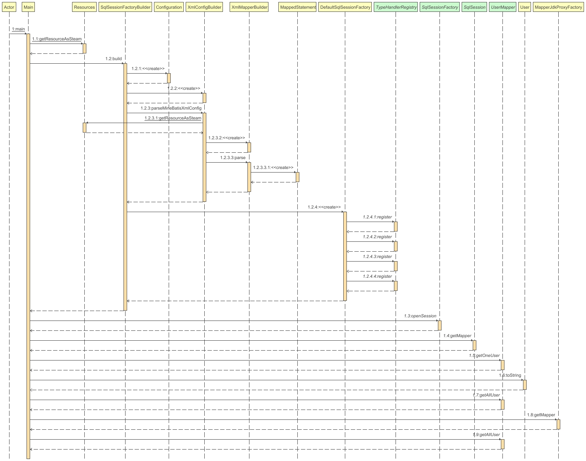

# MineBatis 


简易的半自动Orm框架Demo


## 注意事项:
- 编译结束后方法形参名称可能不再保留,可以加入编译参数解决
- 如果使用idea可以在xml加入如下内容以获得idea的mybatis代码提示与跳转,用其他的ide就可以不加

```xml
<!DOCTYPE mapper PUBLIC "-//mybatis.org//DTD Mapper 3.0//EN" "http://mybatis.org/dtd/mybatis-3-mapper.dtd">
 ```


## 打个广告:
- 大四没事干,软件园日企招打螺丝的一个月实习都4000了,大连hr有没有想联系我的 邮箱:3139196862@qq.com,再找不到活真去打螺丝了


## 项目描述:
- 仿照Mybatis写的一个简单的Orm框架用来练手

## 已经实现:
- 简易的Class映射,仅可以处理单个对象的查询
- 可以使用注解进行简易查询
- 加入了简单的xml支持
- 加入简单的resultMap

## 备注:

- 曾经在AutumnMvc框架中写过一版,但是由于AutumnMvc工作量太大,导致Orm框架的初始设计不够完善,仅能支持注解方式,所以重新写了一个,日后会迁移回AutumnMvc
- 之前那一版放在AutumnFrameworkOldMineBatis软件包中保存,以后可能开一个新的分支进行归档处理

## 代码示范
### Mapper 注解版本
```java
@MyMapper
public interface UserMapper {
    User getOneUser(Integer userId, String password);

    @MySelect("select * from user where UserID > #{nums}")
    List<User> getAllUser(Integer nums);
}

```
### Mapper Xml版本
```java
public interface UserMapper {
    List<User> getSomeUser(Integer userId);
}

```

```xml
<mapper namespace="org.example.Mapper.UserMapper">
  <select id="getSomeUser" resultMap="whyYouDoThis" parameterType="java.lang.Integer">
    SELECT UserID as testUserID,
    Username as testUserName,
    Role,
    `Password`,
    Salt,
    Telephone,
    regTime,
    enabled
    FROM `user`
    where UserId > #{userId}
  </select>
  <resultMap id="whyYouDoThis" type="org.example.JavaBeans.User" isDisable="false">
    <result property="userID" column="testUserID"/>
    <result property="username" column="testUserName"/>
  </resultMap>
</mapper>

```

```java

@Slf4j
public class Main {
    public static void main(String[] args) throws Exception {
        InputStream inputStream = Resources.getResourceAsSteam("minebatis-config.xml");
        //xxx:建造一个SqlSessionFactory出来,构建defaultSqlSessionFactory
        SqlSessionFactory sqlSessionFactory = new SqlSessionFactoryBuilder().build(inputStream);
        //xxx:确定工厂后生产session
        SqlSession sqlSession = sqlSessionFactory.openSession();
        //xxx:SqlSession生产Jdk代理类
        try {
            UserMapper userMapper = sqlSession.getMapper(UserMapper.class);
            log.info(userMapper.getSomeUser(1).toString());
        } catch (Exception e) {
            log.error("执行失败", e);
        }
        //xxx:注解启动
        UserMapper userMapper = new MapperJdkProxyFactory().getMapper(UserMapper.class);
        log.info(userMapper.getSomeUser(1).toString());

    }
}
```

### 项目依赖

```
- c3p0 数据库连接池
- jaxen,dom4j xml解析工具库
- Lombok 
- Mysql-connector-java 
- Slf4j-api
- Logback-classic 实现彩色日志
```

## 已知问题:

- 不知道为什么select * from user limit
  ?总是解析失败,无法解析limit后的问号,使用statement.setInt无法解析但是statement.setString就可以,这个问题仅出现在我写的组件中,在main方法测试倒是没出现这个问题可以正常解析,但是都是一样的代码不知道为什么结果不一样

## 未来打算实现:

- 纳入AutumnIoc容器,避免繁琐的Xml配置

## 更新记录:
### 2024/4/22
- 加入了简单的resultMap,可以手动对字段进行映射,但是目前只支持简单的映射,不支持级联映射,本框架使用isDisable字段进行标注,当isDisable为true时仅映射ResultMap中定义的字段,反之则会尝试自动映射,当遇到resultMap中的内容依照其中的内容进行映射,同时尽可能忽略大小写的差异,框架自动匹配.如果你没有写JavaType则不会进行typeHandler的匹配,如果你写了JavaType则会进行typeHandler的匹配,如果没有匹配到则getObject

### 2024/4/17

- 加入了Xml驱动的部分,和Mybatis一样采用读取Xml配置数据流,建造一个SqlSessionFactory出来,构建defaultSqlSessionFactory
  确定工厂后生产sqlSession,使用getMapper方法生产Jdk代理类
  

### 2024/4/15

- 重写注解驱动的部分,之前采用正则解析拼接的Sql,现在换用Jdbc来做,按照参数的名字与Sql中参数的名字设置映射表同时保存好顺序
  编写了一堆typeHandler来设置参数,之前版本使用反射直接为字段赋值,现在变为Set方法赋值,目前仅支持简单的查询

### 2023/12/29

- AutumnMvc使用的最终版完成

### 2023/6

- 实现了对Jdbc的简易封装
- 实现对接口的代理
- 实现了代理工厂,生产创建好的代理类

### 2023/5

- 实现了简易的Ioc容器,使用容器实现单例模式
- 实现了对JavaBean的字段注入(@Value注解标记)

### 感谢:
- 没有Gpt4写代码寸步难行
- 感谢Jetbrains提供的开源支持idea/pycharm/rider/clion license
- 感谢GitHub提供的学生免费copilot

